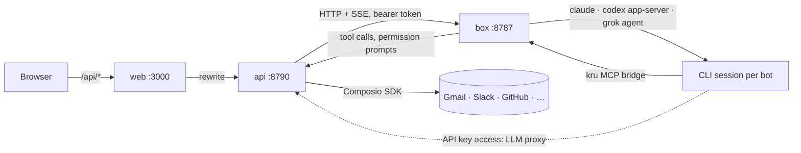

# Kru Bot

A team of always-on AI bots, each with its own computer. Self-hosted, open
source, and it runs on the AI plans you already pay for.

Each bot has a name, a job, a personality (`SOUL.md`), a memory, and a home
folder on a shared Linux box. Under the hood it's a long-running Claude
Code, Codex or Grok session, so it keeps working after you close your
laptop. You message it like a coworker and it checks in when it needs you.

Kru Bot is an independent remake of the idea behind Grok Bot. It isn't
affiliated with xAI, Meta or Anthropic.

## Features

- **Chat with your bots.** One conversation per bot, group rooms, @mentions,
  files, and streaming replies with a live line of what the bot is doing.
- **Bots work together.** They run in parallel, message each other and hand
  work off. Tell one it's your Chief of Staff and it answers in rooms and
  hears first when a teammate's run breaks.
- **Every bot gets a computer.** A Linux box with a shell, a browser and a
  full desktop you can open in the app to take over for a sign-in or a
  CAPTCHA.
- **Approvals.** Per bot: *Manual* (shell commands, files outside its own
  folder and app actions wait for you as a card in the chat) or *Always
  allow*.
- **Your AI, your plan.** Claude Code, Codex or Grok on your own
  subscription, signed in from Settings without a terminal. Or skip the CLI
  and use an API key (Anthropic, OpenAI, xAI or anything compatible), and
  Kru Bot drives the model itself.
- **Connected apps.** Anything Composio supports: Gmail, Slack, GitHub,
  Notion, Linear and hundreds more. You choose which bots can use each one.
- **MCP servers.** Add your own, OAuth sign-in included.
- **Routines.** Cron schedules per bot, like "every weekday at 8:00".
- **Skills.** A shared library of how-tos. Type `/` to hand one to a bot, or
  let a bot save one it just figured out.
- **Secrets the bots never see.** A bot asks with a card, you type the value,
  and the API fills it in where it's needed. Anything a bot writes is
  scrubbed of stored values.
- **Memory.** Each bot has its own, plus a team memory shared by all your
  bots. Handoffs that stall get chased.
- **Notifications.** Push when a bot finishes or needs you, but not for the
  chat you're already looking at.
- **Multiple people.** Add an OIDC provider (Pocket ID, Authentik, Keycloak,
  …) and everyone gets their own bots, AI, apps, secrets and Linux account.
- **Phone and desktop.** The web app is built phone-first and can go on your
  home screen. There's also an Android app and a desktop app (Windows,
  Linux) on the releases page.

## Quick start

```sh
git clone https://github.com/dawsja/krubot && cd krubot
cp .env.example .env    # optional, every variable is commented
docker compose up -d
docker compose logs api | grep "setup token"
```

Open http://localhost:3000, register with the setup token, and follow the
setup: pick your apps, your first bots, and what they run on. Then say hi.

You'll need Docker and, for each person, a Claude, ChatGPT or Grok plan or an
API key. Composio is optional; without it bots still have the shell and the
browser.

To build the images yourself, uncomment the `build` lines in
`docker-compose.yml` and run `docker compose up -d --build`.

## How it works

Three containers:

| Service | What it does |
|---|---|
| `web` | Next.js app. Forwards `/api/*` to the API, so there's one origin and one login. |
| `api` | Hono on Bun with SQLite. Bots, chats, approvals, routines, apps, and the client that drives the box. |
| `box` | The bots' computer: Node, Bun, Python, a browser, the three CLIs and a GNOME desktop. No published ports. |



Each bot keeps a persistent CLI session on the box. When the CLI wants to run
something, the request travels over the `kru` MCP bridge to the API, which
turns it into an approval card. API keys never reach the box: requests go
through the API's LLM proxy, which adds the key on the way out.

## Running it

**The box keeps its state.** Homes, package caches and CLI sign-ins live on
volumes, so they survive restarts and updates.

**Update and Reset** are in Settings → Team (admin only). Update pulls the
newest box image and patches Debian, Bun and the CLIs in place. Reset puts
the computer back to how it was built: every person's account and home goes,
the admin's home is emptied, and the container is rebuilt from its image.
Only the CLI sign-ins are kept, so nobody signs in to their plan again; an
account, a bot's home and its SOUL.md are made again the next time they are
used, and the skills library is written back from the database. Pulling
images needs the Docker socket mounted on the API; set `KRU_DOCKER_GID` to
its group (`stat -c %g /var/run/docker.sock`). Remove the mount if you'd
rather not give the API that; Update then patches in place and skips the
image.

**More people.** The admin is the one local account, made with the setup
token, and can always sign in with a password. To let others in, add your
identity provider in Settings → Authentication. Register a client with the
redirect URL `<APP_URL>/api/auth/callback/oidc` and the sign-out URL
`<APP_URL>/login`. Everyone who signs in that way gets their own Linux
account (`kru-<name>`) with a private home, and nothing is shared between
people except the skills library.

**MCP servers that need a sign-in.** Kru discovers the authorization server,
registers itself as a client and shows a Sign in button. If a server doesn't
allow client registration, set `KRU_MCP_CLIENT_ID` (and
`KRU_MCP_CLIENT_SECRET`) to a client you registered yourself.

**Remote access.** The web app speaks plain HTTP. Put a TLS reverse proxy in
front of `web`, set `APP_URL` to that address, and leave the API and box
unpublished (the compose file already does). Push notifications on phones
need HTTPS.

**Building the Android app.** Java 17+, the Android SDK with platform 36
(`ANDROID_HOME` set) and Gradle 8.13+, then `gradle assembleRelease` in
`apps/android`. Without `KRU_ANDROID_KEYSTORE` and its password and alias
variables it's signed with the debug key.

## Development

Bun everywhere, never npm. Read `CLAUDE.md` first; it has the conventions.

```sh
bun install
bun run dev:api            # http://127.0.0.1:8790
bun run dev:web            # http://127.0.0.1:3000
docker compose up -d box   # set KRU_BOX_URL and KRU_BOX_TOKEN on the API
```

Before a commit:

```sh
bun run lint
bun run typecheck
bun run test
bun run --filter @krubot/web build
```

CI runs the same checks, then builds the images for amd64 and arm64 and
publishes them to GHCR on `main` and on `v*` tags.

```
apps/web         Next.js app (shadcn + Tailwind 4)
apps/api         Hono API: auth, data, dispatcher, approvals, Composio, routines
apps/desktop     Electron app for Windows and Linux
apps/android     Kotlin app: a Connect screen, then the web app
packages/box     The bots' computer: CLI sessions, MCP bridge, desktop, updater
packages/shared  Types, schemas, templates and the app catalog
```

## Security

- Registering the admin account needs the setup token from the API's logs.
- Secrets and keys are encrypted at rest with a key in the data volume
  (`KRU_SECRET_KEY` to bring your own), and never sent to the box.
- App actions run through Composio in the API, so app credentials never
  reach the box either.
- Each person's bots run as that person's unprivileged Linux user. That keeps
  people apart, but it's Unix permissions inside one container, not a hard
  boundary. Separate bots of the same person aren't a boundary at all.
- The Docker socket on the API is the only thing with host access. Drop the
  mount if you don't need Update.

## License

MIT. Provider names and logos are trademarks of their owners.
