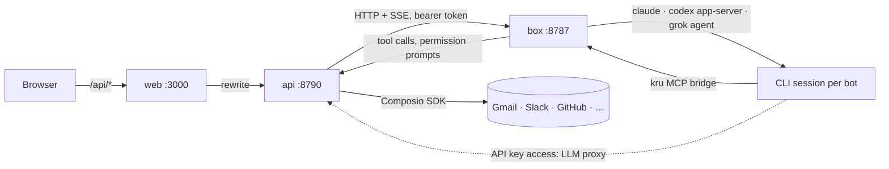

# Kru Bot

Your team of always-on AI bots, each with its own computer. Self-hosted,
open source, and built on the agents you already pay for.

Every bot in the sidebar is a real teammate: it has a name, a job, a
personality (its `SOUL.md`), a memory that compounds, a home folder on a
Linux computer, and a persistent coding-agent session (Claude Code, Codex or
Grok) that keeps working while your laptop is closed. Message it like a colleague, give it real
work, and it comes back when something needs your approval.

Kru Bot is an independent, open-source remake of the idea behind Grok Bot.
It is not affiliated with xAI, Meta or Anthropic.

## What you get

- **Message bots like teammates.** One conversation per bot, group chats
  for several, @mentions, files and images, streaming replies with a live
  line of what the bot is doing.
- **Work with many bots at once.** Create a bot, give it a task, add another
  when the work grows. Bots run in parallel, message each other, and hand
  tasks off. A **Chief of Staff** briefs the others and hears first when one
  of them breaks.
- **Every bot has a computer.** The box: a Linux container with a shell, a
  browser, package caches and a GNOME desktop you can open in the browser
  and take over for a sign-in or a CAPTCHA. Each bot has its own home
  under `~/.bots/<id>` with `SOUL.md`, `MEMORY.md` and whatever it builds.
- **Approvals.** Three levels per bot: ask for everything, auto-accept
  edits, or full access. Shell commands, file changes and connected-app
  writes land as cards in the conversation: allow once, always allow, deny.
- **Connected apps.** Gmail, Slack, GitHub, Notion, Linear and hundreds more
  through Composio. Connect once, pick which bots may use each.
- **Routines.** Cron schedules per bot ("every weekday at 8:00") whose
  answers land in your conversation. Templates ship with one ready, paused.
- **Onboarding.** What you use every day, which teammates to start with, and
  what the bots run on, with a check that it's ready.
- **Claude Code, Codex or Grok.** Settings → AI picks the engine every bot
  runs on (Anthropic's Claude Code, OpenAI's Codex or xAI's Grok Build), on
  your own plan or on an API key, with the model and effort; change it once
  and the whole team switches on its next reply.
- **Your own API keys, kept safe.** An Anthropic-compatible and an
  OpenAI-compatible endpoint (a base URL and a key each). Keys are stored
  encrypted and added to requests by the API on the way out, so the box and
  the bots never hold them.
- **A computer that lasts.** The box keeps its home across restarts and
  image updates, and **Settings → Computer → Update** pauses it, pulls the
  newest image, patches Debian, Bun, Claude Code, Codex and Grok, and brings
  it back.
- **Skills.** One library for the whole team: how to do a job, written
  once (steps, decision rules, what the result looks like, what waits for
  approval). Type `/` in a message to hand one to a bot, run one on a
  schedule from a routine, install one from the marketplace, or let a bot
  save what it just worked out.
- **Your MCP servers.** Attach your own tool servers to every bot. HTTP
  servers are reached through the API, which fills in their headers and
  secrets on the way; commands run on the computer. A server that wants
  you signed in (Robinhood's trading MCP, Linear's) gets a Sign in button:
  the API finds its authorization server, registers as a client and keeps
  the tokens; the bots only ever see the tools.
- **Bots that know who they are.** Tell a bot what it is and it updates
  its own SOUL.md. Tell the Chief of Staff "make @webdesigner's title
  Coder", "give @webdesigner a different expression" or "change its colour"
  and it edits that bot's profile. Type `@` to pick a bot from a list,
  arrow keys or a click. A new bot says hello the moment its conversation
  opens.
- **Connect this app.** Ask a bot to set up Notion (or anything else) and
  it looks for it among Composio's apps first and posts a sign-in link; if
  there isn't one, it says so and points you to Settings → Apps → MCP servers.
- **Secrets the bots never see.** A bot asks for a key with a card; you
  type it into a masked field; the API keeps it encrypted and fills it in
  where it's used. What a bot writes is scrubbed of stored values.
- **Team memory and nudges.** `~/.team/MEMORY.md` loads into every bot's
  turn alongside its own memory. A task one bot hands to another that sits
  unanswered gets chased, then reported.
- **Notifications.** Browser push when a bot finishes a job for you or
  needs your input, per bot, quiet when that conversation is in front of
  you.
- **Yours.** Your profile picture, your password and the theme (light, dark
  or system) live under Settings. Pin the bots you talk to most; search
  finds what was said, not just who.
- **Your team's people.** Settings → Authentication takes an OIDC provider (Pocket
  ID, Authentik, Keycloak, Zitadel, any with discovery); the sign-in page
  gets a "Sign in with …" button, and everyone who uses it gets their own
  bots and conversations. The first account, the one made with the setup
  token, is the admin: the AI, the computer, the apps, the skills, the
  secrets and the provider are its alone. Everyone else is a user.
- **On your phone.** The same app, laid out like a messaging app: a Chats
  screen, a conversation with the bot's details and routines a tap away,
  and Chats, Computer and Settings in a bar at the bottom. Kru Bot for
  Android (an APK on the releases page) asks for your server's address,
  signs you in, and adds phone notifications, file uploads and downloads.
  A phone's browser works too, and can add Kru Bot to the home screen.

## How it runs

Three containers, one `docker-compose.yml`:

| Service | What it is |
|---|---|
| `web` | Next.js + React + shadcn. The app you open. Passes `/api/*` to the API so one origin and one login cover both. |
| `api` | Hono on Bun with `bun:sqlite`. Bots, conversations, approvals, routines, connected apps, and the client that drives the box. |
| `box` | The bots' computer. Node 24, Bun, git, Python, a browser, Claude Code, Codex, Grok, a GNOME desktop over VNC. One home per bot. No published ports. |



Bots run on a coding CLI in the box: **Claude Code** (stream-json), OpenAI
**Codex** (`codex app-server`) or xAI's **Grok Build** (`grok agent stdio`,
the Agent Client Protocol). On your own plan, you sign in once from a
terminal on the box (`claude`, `codex login --device-auth` or
`grok login --device-auth`) and the login stays in the home volume the API
never reads. On an API key, the CLI talks to the API's LLM proxy with a
proxy token, and the API adds the real key on the way out. Each bot and
conversation has a persistent session, so a bot remembers where it was even
when its process was closed in between. The CLI's permission prompts reach
the API through the `kru` MCP bridge (Claude Code's
`--permission-prompt-tool`, Codex's approval requests, Grok's
`session/request_permission`), which is how a shell command or a file edit
becomes an approval card you answer in the chat.

## Quick start

```sh
git clone https://github.com/dawsja/krubot && cd krubot
cp .env.example .env        # optional: set COMPOSIO_API_KEY and friends
docker compose up -d
docker compose logs api | grep "setup token"
```

Open http://localhost:3000, register with the setup token, and run the
setup: pick the apps you use, pick your first teammates, then pick what the
bots run on: sign in to Claude Code, Codex or Grok from a terminal on the
box, or paste an API key. Message a bot.

To make a bot your Chief of Staff, tell it so in its conversation: it
rewrites its own title and description and starts delegating to the others.
There is no checkbox for it.

Requirements: Docker, and a Claude, ChatGPT or Grok plan, or an API key.
Composio is optional: without it, bots still have the browser and the
shell.

To build the images yourself, uncomment the `build` lines in
`docker-compose.yml` and run `docker compose up -d --build`.

### The box is not a throwaway

The bots' computer keeps its state. `/home/agent` is a volume, so what the
bots set up for themselves (global packages, tools, dotfiles, browser
profiles) is still there after `docker compose restart`, after a pull, and
after an update; the bots' homes, package caches and the Claude Code
sign-in have volumes of their own inside it, and Codex's and Grok's
sign-ins live in `~/.codex` and `~/.grok`.

**Settings → Computer → Update** does what "update bot" does in Grok Bot:
the computer pauses (running work stops, terminals and the desktop close,
new messages wait), the newest box image is pulled from GHCR and the box
recreated on it with the same volumes, then the box patches itself in
place (Debian packages, Bun, Claude Code, Codex, Grok) and comes back. The phases and
the log show in Settings as they happen.

Pulling images needs the Docker socket, which `docker-compose.yml` mounts
on the API; set `KRU_DOCKER_GID` to the socket's group
(`stat -c %g /var/run/docker.sock`) in `.env`. Whoever can use that socket
controls Docker on the machine, so remove the mount if you'd rather not;
Update then patches the running box in place and skips the image.

Settings → Computer also shows what runs on the box (Node, Bun, Claude
Code, Codex, Grok) and whether Claude Code is signed in; Settings → AI
shows whether the engine you picked is ready.

**Reset** (next to Update) is the fresh-install button: the home folder is
wiped except the bots' homes, the team's files, the skills and the CLIs'
sign-ins, and the container is rebuilt from its image when the API can reach
Docker.

### Settings

Click your name at the bottom of the sidebar for Settings and Sign out.
Settings has eight sections, each with its own address. Everyone has the
first; the rest are the admin's:

- **Account.** Click your picture to change it (kept in the database,
  shown in the sidebar and on your messages), change your password, pick
  the theme, and turn browser notifications on for this device. Each
  bot's profile has its own notification switch.
- **Team.** The time zone and how many bots work at once.
- **AI.** The engine (Claude Code, Codex or Grok), your plan or an API key
  for it, the model and the effort; and the API keys, an
  Anthropic-compatible and an OpenAI-compatible endpoint, write-only once
  saved.
- **Computer.** Status, versions, Update and Reset.
- **Skills.** The library, an editor, and the marketplace's packaged
  skills.
- **Apps.** Composio's apps with their real logos (connect once, then pick
  which bots may use each in the bot's profile), and your own MCP servers,
  HTTP or command, on or off, with Sign in and Sign out for the ones that
  use OAuth.
- **Secrets.** Names only; values go in once and never come back out.
- **Authentication.** The OIDC provider (name, issuer, client id and secret,
  scopes; the redirect URL to register at the provider), and the people
  who have signed in, with a way to remove one along with their bots.

### More than one person

One local account exists: the admin, made with the setup token. It signs
in with its username and password, always, so a provider outage never
locks it out. To let others in, set up your identity provider under
Settings → Authentication: register a client there with the redirect URL the
card shows (`<APP_URL>/api/auth/callback/oidc`), paste the issuer, the
client id and the secret, save, and turn it on. The sign-in page shows
"Sign in with <name>"; the first sign-in through it creates the person.

Everyone who signs in that way is a user: they create bots, chat, add
routines, approve what their bots ask, and set their own picture, theme
and notifications. They don't see Team, AI, Computer, Skills, Apps,
Secrets or Authentication, and can't open the computer's desktop (it is one
machine every bot shares). Their bots can be given an app or an MCP server
only after the admin marks it **Shared** under Apps; until then a user's
bots have the shell, the browser and the skills. Bots are never shared
between people, and a bot only sees, messages and briefs its owner's
bots.

Every bot still runs on the same computer as the same Linux user, so the
box is not a boundary between people: a bot that reads another bot's home
can. Treat the people you let in as you would people sharing a machine.

### Secrets, and what the bots can't see

A bot never gets a password or key from you in chat. It calls
`request_secret` with a name and a reason; a card appears in the
conversation with a masked field; the value goes to the API, encrypted
with the data volume's key, and the bot only hears that it's stored. The
value is filled in where it's used: an HTTP MCP server's headers written
as `{{secret:NAME}}` are completed by the API's proxy on each request, so
the computer never holds the header. Everything a bot writes back is
scrubbed of stored values. For a website sign-in, a one-time code or a
payment, the bot asks you to take over the computer and type it yourself,
as Grok Bot does.

Commands (stdio MCP servers) run on the computer, so their environment is
visible there; don't put secrets in them.

### MCP servers that need a sign-in

When you add an HTTP server, the API asks it for a tool list without any
credentials. A 401 with the standard `WWW-Authenticate` pointer (or a
`.well-known/oauth-protected-resource` document) tells Kru which
authorization server to use; Kru registers itself there as a client when
the server allows it (most do), and the row in Settings shows **needs
sign-in** with a Sign in button. Clicking it runs a normal authorization
code flow with PKCE in your browser and comes back to
`/api/mcp-servers/oauth/callback`; the tokens are stored encrypted and
refreshed by the API, and every request the bots make through the proxy
carries them. A bot that hits a server before you've signed in is told to
ask you to press Sign in. If a server doesn't offer client registration,
set `KRU_MCP_CLIENT_ID` (and `KRU_MCP_CLIENT_SECRET` if it issued one) to
a client you registered by hand, with the callback above as its redirect
URL under your `APP_URL`.

### Kru Bot on Android

The Android app on the releases page (`Kru-Bot-<version>.apk`) is the web
app in a native shell, the way the desktop app is. Install it, enter the
address you open Kru Bot at (a name, an IP with a port, or a full https
address; on a home network plain http is tried first), and sign in. The
sign-in page and Settings → Account have a way back to Connect to point
the app at another server.

What the app adds to the pages: notifications on the phone when a bot
finishes a job for you or needs your input (turn them on under Settings →
Account; they arrive while Kru Bot is open or in the background), file
uploads from the phone's picker, attachments through the phone's download
manager, links that open in your browser, and sign-ins (Composio, MCP
servers, including the ones that only return to localhost) that come back
into the app.

A phone's browser reaches the same layout: open your Kru Bot, and Add to
Home Screen for an app icon. Browser push notifications need https there,
as on a desktop.

To build the APK yourself: Java 17 or newer, the Android SDK with platform
36 (`ANDROID_HOME` set), and Gradle 8.13 or newer, then
`gradle assembleRelease` in `apps/android`. Without `KRU_ANDROID_KEYSTORE`
(and its `_PASSWORD`, `KRU_ANDROID_KEY_ALIAS`, `KRU_ANDROID_KEY_PASSWORD`)
the release is signed with the debug key, which installs fine but won't
update over a build signed with another key; CI reads the same values from
the repository's secrets (`KRU_ANDROID_KEYSTORE_BASE64` for the file).

### Remote access

The web app listens on the port you publish, without HTTPS. For anything
beyond localhost put a reverse proxy with TLS in front of `web`, set
`APP_URL` to that address, and keep the API and the box unpublished (the
compose file already does).

## Develop

Bun everywhere, never npm. `CLAUDE.md` holds the conventions for new
features (stack, UI rules, data layer, the box, checks before a commit);
read it first.

```sh
bun install
bun run dev:api          # http://127.0.0.1:8790
bun run dev:web          # http://127.0.0.1:3000, proxies /api to the API
docker compose up -d box # or run packages/box/server.mjs as root with BOTS_DIR set
```

Set `KRU_BOX_URL=http://127.0.0.1:8787` and `KRU_BOX_TOKEN` (or
`KRU_BOX_STATE_DIR`) on the API to reach a box outside Compose.

```sh
bun run lint
bun run typecheck
bun run test
bun run --filter @krubot/web build   # the production build CI ships
```

CI (`.github/workflows/build.yml`) runs those, then builds the three images
for amd64 and arm64 and publishes them to GHCR on `main` and on `v*` tags.

The web app is shadcn (base-ui, "nova" style) on Tailwind 4. The shadcn
skill is checked in under `.agents/skills/shadcn` (installed with
`bunx --bun skills add shadcn/ui`) and linked for Claude Code, and so are
Better Auth's (`bunx --bun skills add better-auth/skills`); add
components with `bunx --bun shadcn@latest add <name>` from `apps/web`.

## Layout

```
apps/web         Next.js app: onboarding, bot list, conversations, computer panel, settings
                 (components/ui is shadcn; the rest composes it)
apps/desktop     Electron, Windows installer and Linux AppImage: the web app in its own window, with a
                 Connect page for the server address
apps/android     Kotlin, one activity: a native Connect screen, then the web app in a WebView with
                 notifications, uploads, downloads and sign-ins bridged (kruMobile)
apps/api         Hono API: auth (Better Auth, one account), data (bun:sqlite), dispatcher,
                 CLI driver and LLM proxy, approvals broker, Composio, routines, SSE events,
                 updater.ts + docker.ts (Settings → Computer → Update)
packages/box     The bots' computer: server.mjs, agents.mjs / codex.mjs / grok.mjs (persistent
                 Claude Code, Codex and Grok sessions), bridge.mjs + kru-mcp.mjs (the MCP bridge),
                 desktop.sh, update.sh, Dockerfile
packages/shared  Types, zod schemas, templates and the app catalog shared by web and api
.agents/skills   Agent skills checked in for whoever works on the code (shadcn, Better Auth)
```

## Security notes

- One account per install; registration needs the setup token from the API's logs.
- Secrets at rest are encrypted with a key in the data volume (`KRU_SECRET_KEY` to bring your own).
- The box runs every bot as an unprivileged user; the API reaches it with a bearer token over the Compose network only.
- All of a person's bots share one computer, like Grok Bot. Do not treat separate bots as a security boundary.
- Connected-app credentials never reach the box: the API executes app actions through Composio.
- The Docker socket mounted on the API (for image updates) is the one thing here with host access; drop the mount to keep the API off it.

## License

MIT. Provider names and logos are trademarks of their owners.
